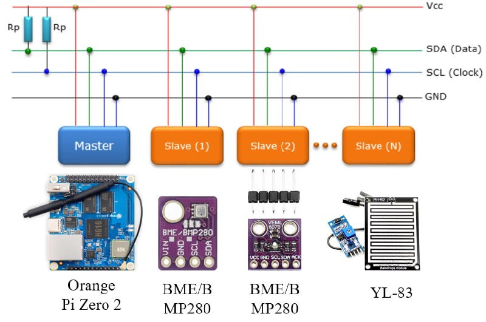
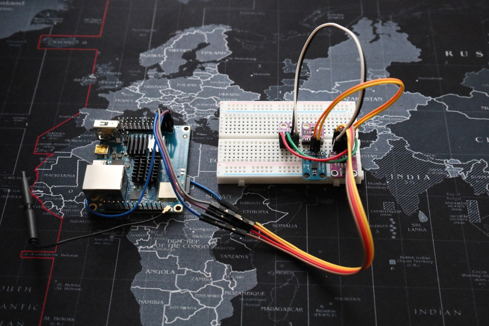
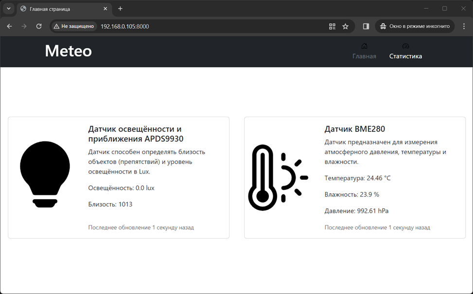
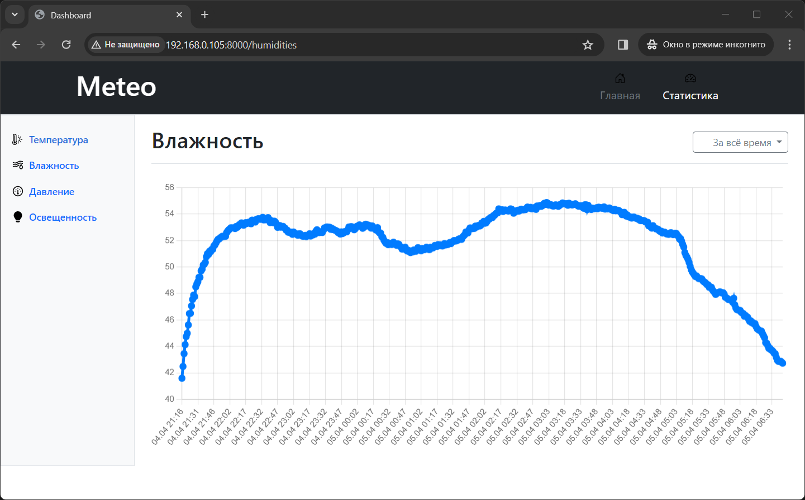

# Метеостанция на снове Django и Orange Pi

Проект метеостанции разработан в рамках дипломного проекта. Целью данного проекта является создание метеостанции,
которая не только соответствует современным требованиям к точности и функциональности, но и доступна широкому кругу
пользователей благодаря использованию открытых технологий и платформ, таких как Orange Pi и Django.

## Запуск на одноплатном компьютере

Чтобы запустить проект на Orange Pi необходимо скопировать проект на внутреннюю память компьютера, например, через SSH,
после чего:

* Создать файлы миграции
  ```python3 manage.py makemigrations```
* Применить миграции
  ```python3 manage.py migrate```
* Запустить серверную часть нашего сайта
  ```python3 manage.py runserver <IP_адрес>:<Порт>```

После запуска сервера по указанному адресу будет находиться веб интерфейс приложения.

### Схема подключения датчиков



### Устройство в сборе



### Главная страница сайта



### Статистика по измеряемым параметрам

